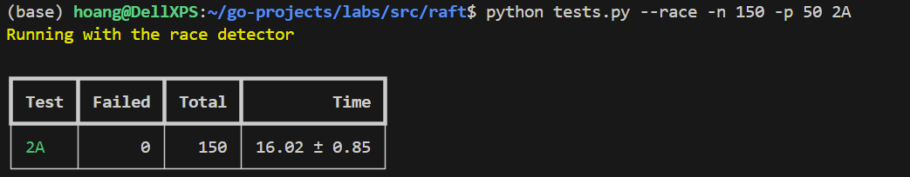
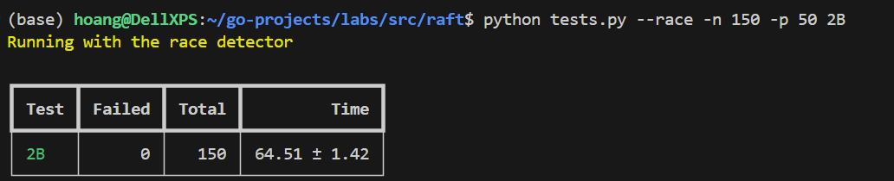
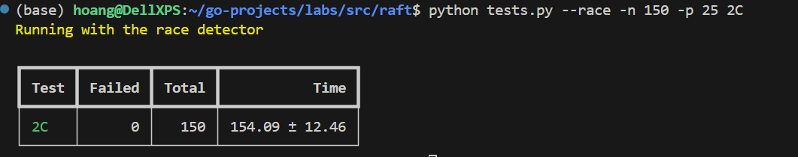
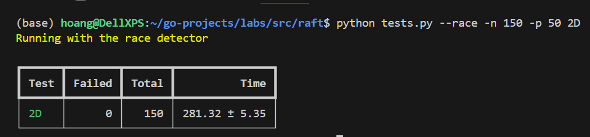

# mit-6.824-labs

6.824 labs, source code is kept private due to [Collaboration Policy](http://nil.csail.mit.edu/6.5840/2023/labs/collab.html).

## Lab 1: MapReduce

MapReduce implementation in Go, operates on the local filesystem but simulates distributed MapReduce. Overall, this lab was straight-forward, although it took some time to get acquainted with Go RPC calls and storing intermediate data.

Brief summary of functionality: 
- One coordinator node and N worker nodes. 
- When a worker is ready, it contacts the coordinator, which assigns the node a task.
- Worker contacts coordinator through RPC calls, see rpc.go for more info on data payloads.
- Coordinator keeps track of all tasks and their progress, and continues to distribute tasks to workers until everything is complete. 
- All map tasks must complete before reduce tasks. Number of reduce tasks are specified by program.
- Each map task maps to nReduce intemediary files on the local filesystem.
- Each reduce task consumes from corresponding intermediary files and produces final result.
- If a task takes too long to complete (>10s), the coordinator will assign the task to a free worker.
- Coordinator prevents data races by using a mutex lock. 

# Lab 2: Raft

## 2A: Leader Election

## 2B: Log 

## 2C: Persistence 

## 2D: Snapshot
